# Tarea 02 – Instalación de WordPress (SGE)

Guía de instalación y configuración de WordPress en Ubuntu Server.

---

##  Índice
1. [Introducción: ¿Qué es WordPress?](#introducción-qué-es-wordpress)
2. [Instalación y configuración de WordPress](#instalación-y-configuración-de-wordpress)
    - [1. Instalación de dependencias](#1-instalación-de-dependencias)
    - [2. Instalar WordPress](#2-instalar-wordpress)
    - [3. Configurar Apache para WordPress](#3-configurar-apache-para-wordpress)
    - [4. Configurar la base de datos](#4-configurar-la-base-de-datos)
    - [5. Configurar WordPress para conectar con la base de datos](#5-configurar-wordpress-para-conectar-con-la-base-de-datos)
    - [6. Configuración inicial de WordPress](#6-configuración-inicial-de-wordpress)
3. [Referencias](#referencias)

---

## Introducción: ¿Qué es WordPress?
WordPress es un sistema de gestión de contenidos de código abierto que permite crear y administrar páginas web y blogs de forma sencilla. Gracias a su facilidad de uso, su gran biblioteca de temas y la amplia variedad de plugins disponibles, es una de las plataformas más populares para el desarrollo de páginas web.

---

## Instalación y configuración de WordPress

### 1. Instalación de dependencias
Actualizamos la lista de paquetes e instalamos Apache, PHP, MySQL y las extensiones necesarias.
```bash
sudo apt update  
sudo apt install apache2 ghostscript libapache2-mod-php mysql-server php php-bcmath php-curl php-imagick php-intl php-json php-mbstring php-mysql php-xml php-zip
````

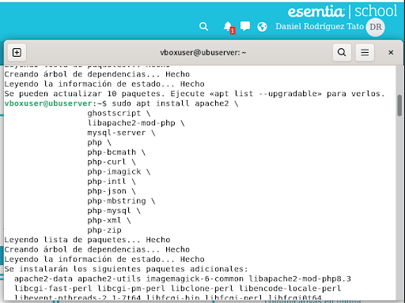

---

### 2. Instalar WordPress
Descargamos la última versión de WordPress y la ubicamos bajo el usuario del servidor web. (https://wordpress.org/)

- Creamos el directorio /srv/www para alojar WordPress.
- Damos la propiedad a www-data.
- Descargamos y extraemos WordPress directamente en ese directorio.

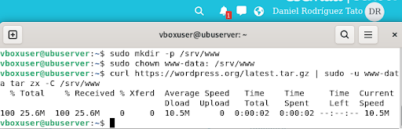

---

### 3. Configurar Apache para WordPress
Creamos el archivo de sitio en `/etc/apache2/sites-available/wordpress.conf` con un contenido similar a:

```apache
<VirtualHost *:80>
    DocumentRoot /srv/www/wordpress
    <Directory /srv/www/wordpress>
        Options FollowSymLinks
        AllowOverride Limit Options FileInfo
        DirectoryIndex index.php
        Require all granted
    </Directory>
    <Directory /srv/www/wordpress/wp-content>
        Options FollowSymLinks
        Require all granted
    </Directory>
</VirtualHost>
````

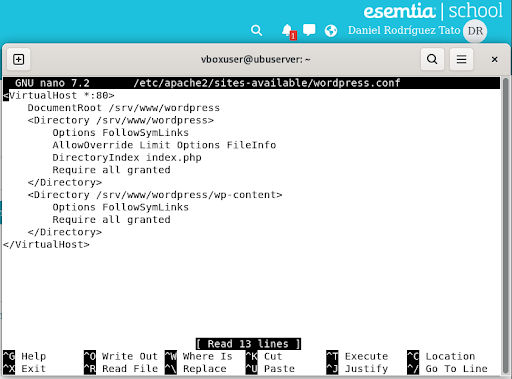

Activamos el sitio y los módulos necesarios:  

sudo a2ensite wordpress → habilita el sitio de WordPress

sudo a2enmod rewrite → activa el módulo de reescritura de URLs

sudo a2dissite 000-default → desactiva el sitio por defecto

sudo service apache2 reload → recarga la configuración de Apache

sudo service apache2 status → muestra el estado del servicio

  
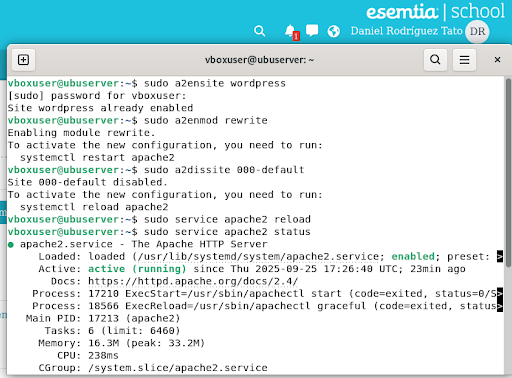

---

### 4. Configurar la base de datos
Entramos al cliente de MySQL como root:

```mysql-sql
sudo mysql -u root 
CREATE DATABASE wordpress;
CREATE USER wordpress@localhost IDENTIFIED BY '<tu-contraseña>';
GRANT SELECT, INSERT, UPDATE, DELETE, CREATE, DROP, ALTER ON wordpress.* TO wordpress@localhost;
FLUSH PRIVILEGES;
QUIT;
````

Explicación:
- CREATE DATABASE wordpress; → crea la base de datos.
- CREATE USER … IDENTIFIED BY … → crea el usuario wordpress con contraseña.
- GRANT … ON wordpress.* → otorga permisos necesarios.
- FLUSH PRIVILEGES; → aplica los cambios.

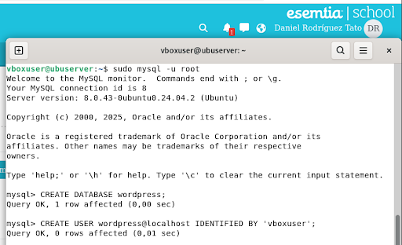  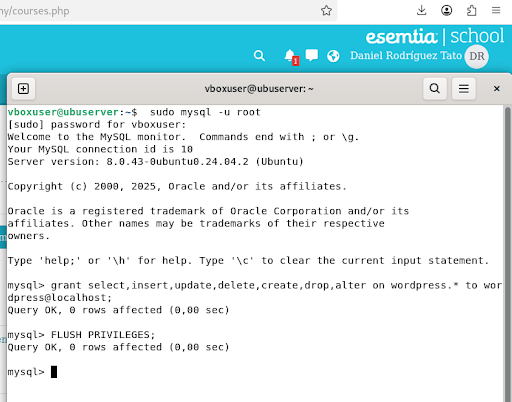

---

### 5. Configurar WordPress para conectar con la base de datos
Copiamos el archivo de ejemplo y configuramos credenciales:  
Comando: sudo -u www-data cp /srv/www/wordpress/wp-config-sample.php /srv/www/wordpress/wp-config.php

Reemplazamos nombre de base de datos, usuario y contraseña:  
Comando: sudo -u www-data sed -i 's/database_name_here/wordpress/' /srv/www/wordpress/wp-config.php  
Comando: sudo -u www-data sed -i 's/username_here/wordpress/' /srv/www/wordpress/wp-config.php  
Comando: sudo -u www-data sed -i 's/password_here/<tu-contraseña>/' /srv/www/wordpress/wp-config.php

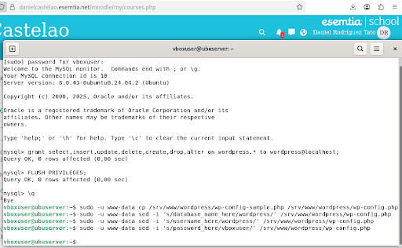

Abrimos el archivo para añadir claves y sales (AUTH_KEY, SECURE_AUTH_KEY, etc.):  
Comando: sudo nano /srv/www/wordpress/wp-config.php

Y donde pone "put your unique phrase here" sustituimos  por valores generados en la API de WordPress. Guardamos con Ctrl+X, Y, Enter.

 
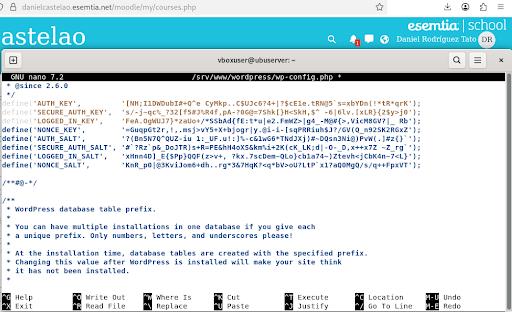

---

### 6. Configuración inicial de WordPress
Accedemos desde el navegador a la IP o dominio del servidor:  
http://<tu-ip-o-dominio>/

El asistente inicial pedirá:
- Nombre del sitio
- Usuario de administración
- Contraseña
- Correo electrónico

Después, accedemos al panel de administración:  
http://<tu-ip-o-dominio>/wp-login.php

En el Dashboard ya se pueden crear entradas, instalar temas y activar plugins.

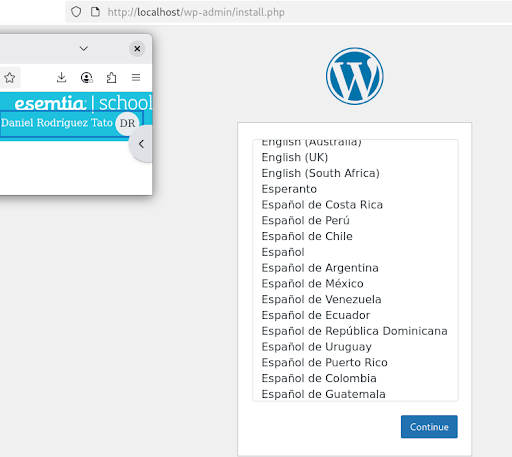  
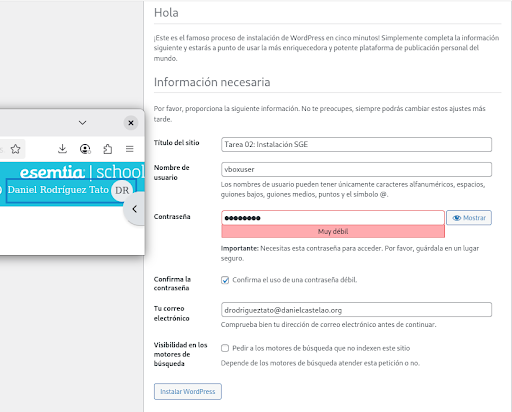  

### 7. Instalación de un tema:
En el apartado apareciancia > temas y buscas el que quieras despeus pulsa actiavr y listo

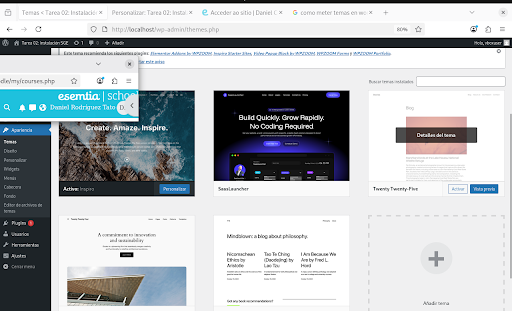

### 8. Instalación de un pluggins:

  


---

## Referencias
- Guía oficial: Install and configure WordPress on Ubuntu — https://ubuntu.com/tutorials/install-and-configure-wordpress
- Página oficial de WordPress - https://wordpress.org/
- Generador de claves - https://api.wordpress.org/secret-key/1.1/salt/
